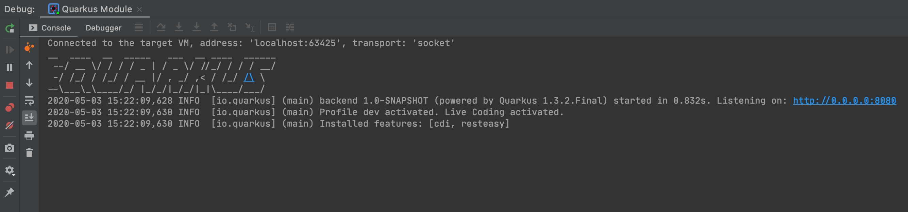

# Quarkus Integration for JetBrains IntelliJ IDEA

This plugin adds features to JetBrains IntelliJ IDEA to integrate [quarkus.io](http://quarkus.io) a lot better and make it behave like
a "normal IntelliJ IDEA application". This means that this plugin will execute all necessary build steps automatically and attaches a debugger if you want to.
Debug your quarkus applications without effort!  

:white_check_mark: IntelliJ Version 2020.1

:white_check_mark: Maven Plugin

## Features
### Quarkus Run Configuration Type
This plugin adds a run configuration type, named "Quarkus". 
It will execute the "clean build quarkus:dev" maven goals in background and attach a new debugger instance via remote config if necessary.

Working Directory: The root maven module to execute maven in

VM Options: A list of parameters which will be delegated to maven

JRE: Maven will use this JRE to run

Environment Variables: Variables that will be passed to maven execution

### Debug your Quarkus Applications

If you want to debug your quarkus application, just start the newly added run configuration type within debug mode.
It will automatically assign a new port to the "quarkus:dev" step and connects via remote debug config - 
so seamless, that you won't notice any difference to your other java projects.