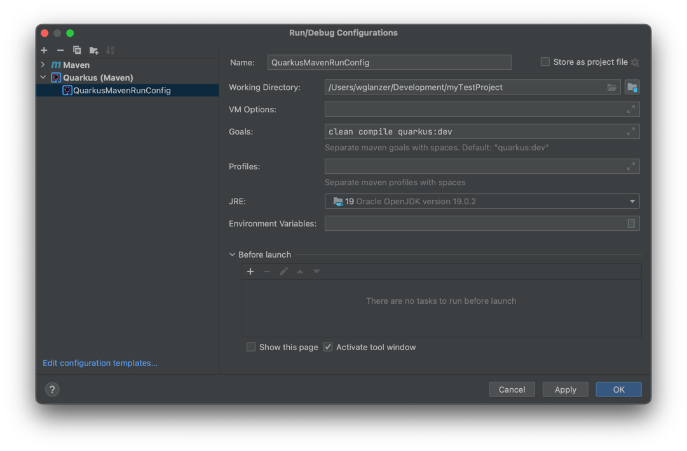
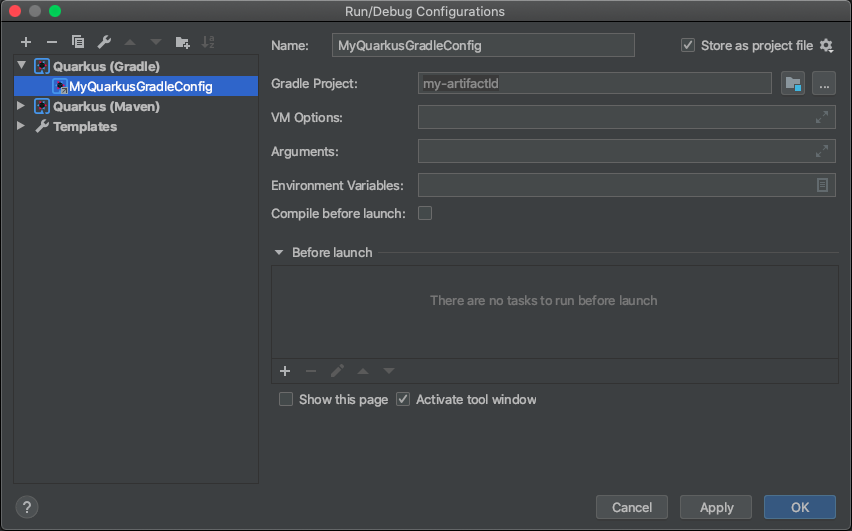

# Quarkus Integration for JetBrains IntelliJ IDEA

<!-- Plugin description -->
This plugin adds features to JetBrains IntelliJ IDEA to integrate [quarkus.io](https://quarkus.io) a lot better and make it behave like
a "normal IntelliJ IDEA application". This means that this plugin will execute all necessary build steps automatically and attaches a debugger if you want to.
Debug your quarkus applications without effort!
<!-- Plugin description end -->

:white_check_mark: IntelliJ Version 2020.1 ( https://plugins.jetbrains.com/plugin/14242-quarkus-integration )

:white_check_mark: Maven Plugin

:white_check_mark: Gradle Plugin

## Features
### Quarkus Run Configuration Type
#### Build Tool: Maven
This plugin adds a run configuration type, named "Quarkus (Maven)". 
It will execute the "quarkus:dev" maven goal in background and attach a new debugger instance via remote config if necessary.

Working Directory: The root maven module to execute maven in

VM Options: A list of parameters which will be delegated to maven

Goals: A whitespace separated list of goals that should be executed on quarkus startup. Make sure, that you include "quarkus:dev" if you want to debug your service.

Profiles: A whitespace separated list of profiles that should be used on quarkus startup.

JRE: Maven will use this JRE to run

Environment Variables: Variables that will be passed to maven execution environment

#### Build Tool: Gradle
This plugin adds a run configuration type, named "Quarkus (Gradle)" for gradle too.
It will execute the "quarkusDev" gradle task in background and attach a new debugger isntance via remote config if necessary.

Gradle Project: The root gradle project to start the quarkus build in

VM Options: A list of parameters which will be delegated to gradle

Tasks: A whitespace separated list of tasks that should be executed on quarkus startup. Make sure, that you include "quarkusDev" if you want to debug your service.

Arguments: Arguments that will be delegated to gradle

Environment Variables: Variables that will be passed to gradle execution environment

### Debug your Quarkus applications

If you want to debug your quarkus application, just start the newly added run configuration type within debug mode.
It will automatically assign a new port to the "quarkus:dev" step and connects via remote debug config - 
so seamless, that you won't notice any difference to your other java projects.

## How to install?
### Official Release
You can download this plugin within the official JetBrains plugin dialog integrated in IntelliJ IDEA.

### GitHub Release
There can be some releases which are not supposed to be publicly available yet.
Those releases can be installed manually by downloading the latest releases on github.

[https://github.com/conceptivesolutions/quarkus-intellij-plugin/releases/latest](https://github.com/conceptivesolutions/quarkus-intellij-plugin/releases/latest)

The downloaded .zip file can be installed within the official JetBrains plugin dialog too.
Just click "Install Plugin from Disk..." and select your previously downloaded file.

